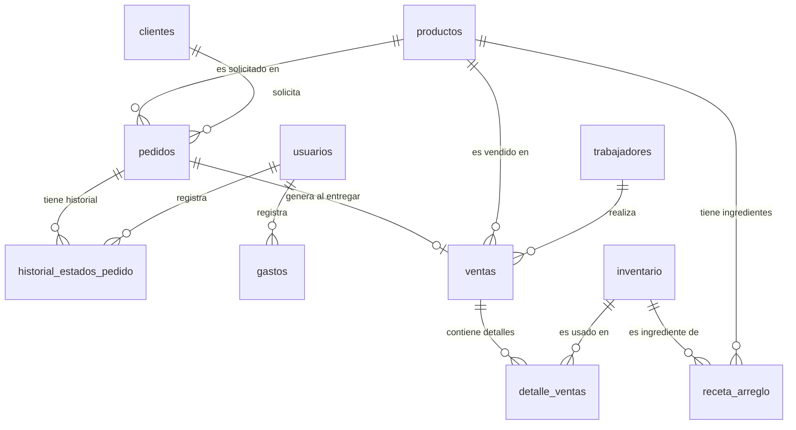

# Design Document: Sistema de Gestión de Florería "Encantos Eternos"

## Overview

El sistema de gestión de florería "Encantos Eternos" es una aplicación web completa que integra tres componentes principales: un frontend público para clientes, un panel administrativo para gestión interna, y un backend API REST con base de datos PostgreSQL.

### Objetivos del Sistema

- Gestionar el catálogo de productos florales y su visualización pública
- Controlar el inventario de flores y materiales con alertas automáticas
- Registrar y rastrear pedidos desde su creación hasta la entrega
- Registrar ventas y asociarlas con trabajadores
- Crear arreglos florales personalizados mediante el Laboratorio de Flores
- Generar reportes de ventas, productos y desempeño
- Gestionar clientes, trabajadores y gastos operativos
- Calcular automáticamente costos, márgenes y ganancias netas

### Stack Tecnológico

- **Frontend Público**: HTML5, CSS3, Bootstrap 5, JavaScript vanilla
- **Panel Administrativo**: HTML5, CSS3, Bootstrap 5, JavaScript vanilla, Chart.js
- **Backend**: Node.js + Express.js
- **Base de Datos**: PostgreSQL 14+
- **Autenticación**: JWT (JSON Web Tokens)
- **Seguridad**: bcrypt para hashing de contraseñas
- **Comunicación**: API REST con formato JSON

### Alcance

El sistema cubre:
- Gestión completa de productos, inventario, pedidos y ventas
- Laboratorio de flores para crear arreglos personalizados con cálculo automático de costos
- Control de inventario automático al realizar ventas
- Sistema de estados para pedidos (pendiente → preparando → listo → entregado)
- Dashboard con KPIs y gráficos
- Reportes de ventas, productos más vendidos y desempeño por trabajador
- Integración con WhatsApp para comunicación con clientes
- Gestión de usuarios con roles (Administrador, Empleado, Dueña)


## Architecture

### Arquitectura General

El sistema sigue una arquitectura de tres capas:

```
┌─────────────────────────────────────────────────────────────┐
│                    CAPA DE PRESENTACIÓN                      │
├──────────────────────────┬──────────────────────────────────┤
│   Frontend Público       │    Panel Administrativo          │
│   (index.html)           │    (dashboard.html)              │
│   - Catálogo productos   │    - Dashboard con KPIs          │
│   - Filtros categorías   │    - Gestión productos           │
│   - Laboratorio flores   │    - Gestión inventario          │
│   - Integración WhatsApp │    - Gestión pedidos/ventas      │
│                          │    - Gestión clientes/trabajadores│
│                          │    - Reportes y gráficos         │
└──────────────────────────┴──────────────────────────────────┘
                            ▼
                    HTTP/HTTPS (JSON)
                            ▼
┌─────────────────────────────────────────────────────────────┐
│                    CAPA DE APLICACIÓN                        │
│                  Backend API REST (Express.js)               │
├─────────────────────────────────────────────────────────────┤
│  Módulos:                                                    │
│  - Autenticación (JWT)                                       │
│  - Productos                                                 │
│  - Inventario                                                │
│  - Pedidos                                                   │
│  - Ventas                                                    │
│  - Clientes                                                  │
│  - Trabajadores                                              │
│  - Gastos                                                    │
│  - Reportes                                                  │
│  - Laboratorio (cálculo de costos y recetas)                │
└─────────────────────────────────────────────────────────────┘
                            ▼
                    SQL Queries (pg)
                            ▼
┌─────────────────────────────────────────────────────────────┐
│                    CAPA DE DATOS                             │
│                  PostgreSQL Database                         │
├─────────────────────────────────────────────────────────────┤
│  Tablas:                                                     │
│  - usuarios, trabajadores, clientes                          │
│  - productos, inventario                                     │
│  - pedidos, ventas, detalle_ventas                           │
│  - arreglos, receta_arreglo                                  │
│  - gastos                                                    │
└─────────────────────────────────────────────────────────────┘
```

### Flujo de Datos Principal

1. **Autenticación**: Usuario → Backend (POST /api/v1/auth/login) → JWT Token → Almacenado en localStorage
2. **Operaciones CRUD**: Frontend → Backend (con JWT en headers) → PostgreSQL → Respuesta JSON
3. **Venta**: Registro venta → Actualización inventario (transacción) → Respuesta
4. **Pedido entregado**: Cambio estado → Creación automática de venta → Actualización inventario


### Patrones de Diseño

- **MVC (Model-View-Controller)**: Separación entre lógica de negocio (backend), presentación (frontend) y datos (PostgreSQL)
- **Repository Pattern**: Capa de acceso a datos que abstrae las consultas SQL
- **Middleware Pattern**: Autenticación, validación y manejo de errores como middleware de Express
- **Factory Pattern**: Generación de respuestas JSON estandarizadas
- **Transaction Pattern**: Operaciones que afectan múltiples tablas (ventas + inventario) se ejecutan en transacciones

### Decisiones Arquitectónicas

1. **API REST sobre GraphQL**: REST es más simple para este caso de uso y el equipo tiene más experiencia
2. **JWT sobre sesiones**: Permite escalabilidad horizontal sin estado compartido
3. **PostgreSQL sobre MongoDB**: Los datos son altamente relacionales (productos-inventario-ventas-pedidos)
4. **Frontend vanilla JS sobre frameworks**: Menor complejidad, carga más rápida, suficiente para la escala del proyecto
5. **Transacciones para ventas**: Garantiza consistencia entre registro de venta y actualización de inventario


## Components and Interfaces

### Backend API Modules

#### 1. Authentication Module (`/api/v1/auth`)

**Responsabilidades**:
- Validar credenciales de usuario
- Generar y validar tokens JWT
- Gestionar sesiones y expiración

**Endpoints**:
```
POST /api/v1/auth/login
  Request: { username: string, password: string }
  Response: { token: string, user: { id, name, role } }
  
POST /api/v1/auth/logout
  Request: { token: string }
  Response: { success: boolean }
  
GET /api/v1/auth/verify
  Headers: Authorization: Bearer <token>
  Response: { valid: boolean, user: { id, name, role } }
```

#### 2. Products Module (`/api/v1/productos`)

**Responsabilidades**:
- CRUD de productos
- Cálculo de márgenes de ganancia
- Gestión de recetas de arreglos

**Endpoints**:
```
GET /api/v1/productos
  Query: ?categoria=<string>&activo=<boolean>
  Response: { productos: Array<Producto> }

GET /api/v1/productos/:id
  Response: { producto: Producto, receta?: Array<RecetaItem> }

POST /api/v1/productos
  Request: { nombre, categoria, precio, costo, descripcion?, imagen_url?, receta?: Array }
  Response: { producto: Producto, id: number }

PUT /api/v1/productos/:id
  Request: { nombre?, categoria?, precio?, costo?, descripcion?, imagen_url?, activo? }
  Response: { producto: Producto }

DELETE /api/v1/productos/:id
  Response: { success: boolean }
  Note: Soft delete (marca activo=false)
```

#### 3. Inventory Module (`/api/v1/inventario`)

**Responsabilidades**:
- CRUD de items de inventario
- Tracking de cantidades
- Generación de alertas de stock bajo

**Endpoints**:
```
GET /api/v1/inventario
  Query: ?estado=<ok|bajo|critico>
  Response: { items: Array<InventarioItem>, alertas: number }

GET /api/v1/inventario/:id
  Response: { item: InventarioItem }

POST /api/v1/inventario
  Request: { nombre, cantidad, unidad, minimo_stock, costo_unitario }
  Response: { item: InventarioItem, id: number }

PUT /api/v1/inventario/:id
  Request: { nombre?, cantidad?, unidad?, minimo_stock?, costo_unitario? }
  Response: { item: InventarioItem }

DELETE /api/v1/inventario/:id
  Response: { success: boolean }

GET /api/v1/inventario/alertas
  Response: { alertas: Array<{ item, cantidad_actual, minimo, estado }> }
```


#### 4. Orders Module (`/api/v1/pedidos`)

**Responsabilidades**:
- CRUD de pedidos
- Gestión de estados (pendiente → preparando → listo → entregado → cancelado)
- Conversión automática a venta al marcar como entregado

**Endpoints**:
```
GET /api/v1/pedidos
  Query: ?estado=<string>&fecha_desde=<date>&fecha_hasta=<date>&cliente_id=<number>
  Response: { pedidos: Array<Pedido> }

GET /api/v1/pedidos/:id
  Response: { pedido: Pedido, historial_estados: Array<EstadoHistorial> }

POST /api/v1/pedidos
  Request: { cliente_id, producto_id, fecha_entrega, precio, notas? }
  Response: { pedido: Pedido, id: number }

PUT /api/v1/pedidos/:id
  Request: { estado?, fecha_entrega?, precio?, notas? }
  Response: { pedido: Pedido }
  Note: Si estado cambia a 'entregado', crea venta automáticamente

DELETE /api/v1/pedidos/:id
  Response: { success: boolean }

GET /api/v1/pedidos/pendientes/count
  Response: { count: number }
```

#### 5. Sales Module (`/api/v1/ventas`)

**Responsabilidades**:
- Registro de ventas
- Actualización automática de inventario
- Cálculo de totales diarios y mensuales

**Endpoints**:
```
GET /api/v1/ventas
  Query: ?fecha_desde=<date>&fecha_hasta=<date>&trabajador_id=<number>
  Response: { ventas: Array<Venta> }

GET /api/v1/ventas/:id
  Response: { venta: Venta, detalles: Array<DetalleVenta> }

POST /api/v1/ventas
  Request: { 
    producto_id, 
    cantidad, 
    precio, 
    metodo_pago: 'Efectivo'|'Yape'|'Tarjeta'|'Transferencia',
    trabajador_id 
  }
  Response: { venta: Venta, id: number }
  Note: Ejecuta en transacción con actualización de inventario

GET /api/v1/ventas/totales/dia
  Query: ?fecha=<date>
  Response: { total: number, cantidad_transacciones: number }

GET /api/v1/ventas/totales/mes
  Query: ?mes=<number>&anio=<number>
  Response: { total: number, cantidad_transacciones: number }
```


#### 6. Clients Module (`/api/v1/clientes`)

**Responsabilidades**:
- CRUD de clientes
- Historial de compras por cliente
- Cálculo de total de compras

**Endpoints**:
```
GET /api/v1/clientes
  Query: ?buscar=<string>
  Response: { clientes: Array<Cliente> }

GET /api/v1/clientes/:id
  Response: { cliente: Cliente, historial_compras: Array<Pedido>, total_compras: number }

POST /api/v1/clientes
  Request: { nombre, telefono, email?, direccion? }
  Response: { cliente: Cliente, id: number }

PUT /api/v1/clientes/:id
  Request: { nombre?, telefono?, email?, direccion? }
  Response: { cliente: Cliente }

DELETE /api/v1/clientes/:id
  Response: { success: boolean }
```

#### 7. Workers Module (`/api/v1/trabajadores`)

**Responsabilidades**:
- CRUD de trabajadores
- Historial de ventas por trabajador
- Cálculo de total de ventas

**Endpoints**:
```
GET /api/v1/trabajadores
  Response: { trabajadores: Array<Trabajador> }

GET /api/v1/trabajadores/:id
  Response: { trabajador: Trabajador, historial_ventas: Array<Venta>, total_ventas: number }

POST /api/v1/trabajadores
  Request: { nombre, rol, telefono, email? }
  Response: { trabajador: Trabajador, id: number }

PUT /api/v1/trabajadores/:id
  Request: { nombre?, rol?, telefono?, email? }
  Response: { trabajador: Trabajador }

DELETE /api/v1/trabajadores/:id
  Response: { success: boolean }
```

#### 8. Expenses Module (`/api/v1/gastos`)

**Responsabilidades**:
- CRUD de gastos
- Cálculo de totales por período
- Categorización de gastos

**Endpoints**:
```
GET /api/v1/gastos
  Query: ?fecha_desde=<date>&fecha_hasta=<date>&categoria=<string>
  Response: { gastos: Array<Gasto> }

GET /api/v1/gastos/:id
  Response: { gasto: Gasto }

POST /api/v1/gastos
  Request: { descripcion, monto, categoria: 'Compras'|'Transporte'|'Materiales'|'Servicios'|'Otros', fecha }
  Response: { gasto: Gasto, id: number }

PUT /api/v1/gastos/:id
  Request: { descripcion?, monto?, categoria?, fecha? }
  Response: { gasto: Gasto }

DELETE /api/v1/gastos/:id
  Response: { success: boolean }

GET /api/v1/gastos/totales
  Query: ?fecha_desde=<date>&fecha_hasta=<date>
  Response: { total: number, por_categoria: Object }
```


#### 9. Reports Module (`/api/v1/reportes`)

**Responsabilidades**:
- Generación de reportes de ventas
- Reportes de productos más vendidos
- Reportes de desempeño por trabajador
- Cálculo de ganancia neta

**Endpoints**:
```
GET /api/v1/reportes/ventas
  Query: ?fecha_desde=<date>&fecha_hasta=<date>
  Response: { 
    total_ventas: number, 
    total_costos: number, 
    ganancia_bruta: number,
    ventas_por_dia: Array<{ fecha, total }> 
  }

GET /api/v1/reportes/productos-mas-vendidos
  Query: ?fecha_desde=<date>&fecha_hasta=<date>&limite=<number>
  Response: { productos: Array<{ producto, cantidad_vendida, total_ingresos }> }

GET /api/v1/reportes/ventas-por-trabajador
  Query: ?fecha_desde=<date>&fecha_hasta=<date>
  Response: { trabajadores: Array<{ trabajador, total_ventas, cantidad_transacciones }> }

GET /api/v1/reportes/ganancia-neta
  Query: ?mes=<number>&anio=<number>
  Response: { 
    total_ventas: number, 
    total_costos: number, 
    total_gastos: number, 
    ganancia_neta: number,
    margen_neto: number 
  }
```

#### 10. Laboratory Module (`/api/v1/laboratorio`)

**Responsabilidades**:
- Cálculo de costos de arreglos personalizados
- Sugerencia de precio de venta basado en margen
- Validación de disponibilidad de inventario
- Guardado de recetas

**Endpoints**:
```
POST /api/v1/laboratorio/calcular
  Request: { 
    ingredientes: Array<{ inventario_id, cantidad }>,
    margen_porcentaje: number 
  }
  Response: { 
    costo_total: number, 
    precio_sugerido: number,
    disponible: boolean,
    ingredientes_insuficientes?: Array<string>
  }

POST /api/v1/laboratorio/guardar-arreglo
  Request: { 
    nombre, 
    categoria, 
    precio, 
    descripcion?,
    imagen_url?,
    receta: Array<{ inventario_id, cantidad }> 
  }
  Response: { producto: Producto, id: number }
  Note: Crea producto y guarda receta en tabla receta_arreglo
```

### Frontend Components

#### Frontend Público (index.html)

**Componentes**:
- Navbar con navegación y botones de WhatsApp/Login
- Hero section con llamados a acción
- Sección de eventos (productos por categoría "Eventos")
- Sección de sorpresas (productos por categoría "Sorpresas")
- Sección de promociones (productos con descuento)
- Catálogo completo con filtros por categoría
- Laboratorio de flores (interfaz para crear arreglos)
- Footer con información de contacto
- Modal de login

**Interacciones**:
- Filtrado de productos por categoría (client-side)
- Generación de mensajes de WhatsApp con datos del producto
- Autenticación y redirección a dashboard


#### Panel Administrativo (dashboard.html)

**Componentes**:
- Sidebar con navegación por secciones
- Topbar con título, fecha, notificaciones y acceso rápido a WhatsApp
- Dashboard con KPIs (ventas día/mes, pedidos pendientes, ganancia neta)
- Gráficos (ventas semanales, productos más vendidos)
- Secciones de gestión:
  - Pedidos: tabla con filtros, búsqueda, cambio de estados
  - Ventas: registro de ventas, tabla de transacciones
  - Productos: CRUD con búsqueda y filtros
  - Inventario: CRUD con alertas de stock
  - Clientes: CRUD con historial de compras
  - Trabajadores: CRUD con historial de ventas
  - Gastos: CRUD con filtros por categoría
  - Reportes: generación de reportes con filtros de fecha
  - Usuarios: gestión de usuarios del sistema
- Modales para crear/editar registros

**Interacciones**:
- Navegación entre secciones sin recargar página
- Llamadas AJAX a la API para todas las operaciones
- Actualización en tiempo real de KPIs y tablas
- Validación de formularios antes de enviar
- Manejo de errores con notificaciones visuales


## Data Models

### Database Schema

#### Tabla: usuarios

```sql
CREATE TABLE usuarios (
  id SERIAL PRIMARY KEY,
  username VARCHAR(50) UNIQUE NOT NULL,
  password_hash VARCHAR(255) NOT NULL,
  nombre VARCHAR(100) NOT NULL,
  rol VARCHAR(20) NOT NULL CHECK (rol IN ('Administrador', 'Empleado', 'Dueña')),
  email VARCHAR(100),
  activo BOOLEAN DEFAULT true,
  fecha_creacion TIMESTAMP DEFAULT CURRENT_TIMESTAMP,
  ultima_sesion TIMESTAMP
);

CREATE INDEX idx_usuarios_username ON usuarios(username);
CREATE INDEX idx_usuarios_rol ON usuarios(rol);
```

#### Tabla: trabajadores

```sql
CREATE TABLE trabajadores (
  id SERIAL PRIMARY KEY,
  nombre VARCHAR(100) NOT NULL,
  rol VARCHAR(50) NOT NULL,
  telefono VARCHAR(20) NOT NULL,
  email VARCHAR(100),
  activo BOOLEAN DEFAULT true,
  fecha_contratacion DATE DEFAULT CURRENT_DATE,
  fecha_creacion TIMESTAMP DEFAULT CURRENT_TIMESTAMP
);

CREATE INDEX idx_trabajadores_nombre ON trabajadores(nombre);
```

#### Tabla: clientes

```sql
CREATE TABLE clientes (
  id SERIAL PRIMARY KEY,
  nombre VARCHAR(100) NOT NULL,
  telefono VARCHAR(20) NOT NULL,
  email VARCHAR(100),
  direccion TEXT,
  fecha_registro TIMESTAMP DEFAULT CURRENT_TIMESTAMP,
  total_compras DECIMAL(10,2) DEFAULT 0
);

CREATE INDEX idx_clientes_nombre ON clientes(nombre);
CREATE INDEX idx_clientes_telefono ON clientes(telefono);
```

#### Tabla: productos

```sql
CREATE TABLE productos (
  id SERIAL PRIMARY KEY,
  nombre VARCHAR(100) NOT NULL,
  categoria VARCHAR(50) NOT NULL CHECK (categoria IN ('Ramos', 'Cajas', 'Arreglos', 'Sorpresas', 'Eventos')),
  descripcion TEXT,
  precio DECIMAL(10,2) NOT NULL CHECK (precio > 0),
  costo DECIMAL(10,2) NOT NULL CHECK (costo >= 0),
  margen_porcentaje DECIMAL(5,2) GENERATED ALWAYS AS ((precio - costo) / costo * 100) STORED,
  imagen_url TEXT,
  activo BOOLEAN DEFAULT true,
  tiene_receta BOOLEAN DEFAULT false,
  fecha_creacion TIMESTAMP DEFAULT CURRENT_TIMESTAMP,
  fecha_actualizacion TIMESTAMP DEFAULT CURRENT_TIMESTAMP
);

CREATE INDEX idx_productos_categoria ON productos(categoria);
CREATE INDEX idx_productos_activo ON productos(activo);
CREATE INDEX idx_productos_nombre ON productos(nombre);
```


#### Tabla: inventario

```sql
CREATE TABLE inventario (
  id SERIAL PRIMARY KEY,
  nombre VARCHAR(100) NOT NULL,
  cantidad DECIMAL(10,2) NOT NULL CHECK (cantidad >= 0),
  unidad VARCHAR(20) NOT NULL,
  minimo_stock DECIMAL(10,2) NOT NULL CHECK (minimo_stock >= 0),
  costo_unitario DECIMAL(10,2) NOT NULL CHECK (costo_unitario >= 0),
  estado VARCHAR(20) GENERATED ALWAYS AS (
    CASE 
      WHEN cantidad < minimo_stock * 0.5 THEN 'critico'
      WHEN cantidad < minimo_stock THEN 'bajo'
      ELSE 'ok'
    END
  ) STORED,
  fecha_creacion TIMESTAMP DEFAULT CURRENT_TIMESTAMP,
  fecha_actualizacion TIMESTAMP DEFAULT CURRENT_TIMESTAMP
);

CREATE INDEX idx_inventario_estado ON inventario(estado);
CREATE INDEX idx_inventario_nombre ON inventario(nombre);
```

#### Tabla: receta_arreglo

```sql
CREATE TABLE receta_arreglo (
  id SERIAL PRIMARY KEY,
  producto_id INTEGER NOT NULL REFERENCES productos(id) ON DELETE CASCADE,
  inventario_id INTEGER NOT NULL REFERENCES inventario(id) ON DELETE RESTRICT,
  cantidad DECIMAL(10,2) NOT NULL CHECK (cantidad > 0),
  UNIQUE(producto_id, inventario_id)
);

CREATE INDEX idx_receta_producto ON receta_arreglo(producto_id);
CREATE INDEX idx_receta_inventario ON receta_arreglo(inventario_id);
```

#### Tabla: pedidos

```sql
CREATE TABLE pedidos (
  id SERIAL PRIMARY KEY,
  cliente_id INTEGER NOT NULL REFERENCES clientes(id) ON DELETE RESTRICT,
  producto_id INTEGER NOT NULL REFERENCES productos(id) ON DELETE RESTRICT,
  fecha_pedido TIMESTAMP DEFAULT CURRENT_TIMESTAMP,
  fecha_entrega DATE NOT NULL,
  precio DECIMAL(10,2) NOT NULL CHECK (precio > 0),
  estado VARCHAR(20) NOT NULL DEFAULT 'pendiente' 
    CHECK (estado IN ('pendiente', 'preparando', 'listo', 'entregado', 'cancelado')),
  notas TEXT,
  fecha_actualizacion TIMESTAMP DEFAULT CURRENT_TIMESTAMP
);

CREATE INDEX idx_pedidos_cliente ON pedidos(cliente_id);
CREATE INDEX idx_pedidos_estado ON pedidos(estado);
CREATE INDEX idx_pedidos_fecha_entrega ON pedidos(fecha_entrega);
```

#### Tabla: historial_estados_pedido

```sql
CREATE TABLE historial_estados_pedido (
  id SERIAL PRIMARY KEY,
  pedido_id INTEGER NOT NULL REFERENCES pedidos(id) ON DELETE CASCADE,
  estado_anterior VARCHAR(20),
  estado_nuevo VARCHAR(20) NOT NULL,
  fecha_cambio TIMESTAMP DEFAULT CURRENT_TIMESTAMP,
  usuario_id INTEGER REFERENCES usuarios(id)
);

CREATE INDEX idx_historial_pedido ON historial_estados_pedido(pedido_id);
```


#### Tabla: ventas

```sql
CREATE TABLE ventas (
  id SERIAL PRIMARY KEY,
  producto_id INTEGER NOT NULL REFERENCES productos(id) ON DELETE RESTRICT,
  cantidad INTEGER NOT NULL CHECK (cantidad > 0),
  precio_unitario DECIMAL(10,2) NOT NULL CHECK (precio_unitario > 0),
  precio_total DECIMAL(10,2) GENERATED ALWAYS AS (cantidad * precio_unitario) STORED,
  metodo_pago VARCHAR(20) NOT NULL CHECK (metodo_pago IN ('Efectivo', 'Yape', 'Tarjeta', 'Transferencia')),
  trabajador_id INTEGER NOT NULL REFERENCES trabajadores(id) ON DELETE RESTRICT,
  pedido_id INTEGER REFERENCES pedidos(id),
  fecha_venta TIMESTAMP DEFAULT CURRENT_TIMESTAMP
);

CREATE INDEX idx_ventas_fecha ON ventas(fecha_venta);
CREATE INDEX idx_ventas_trabajador ON ventas(trabajador_id);
CREATE INDEX idx_ventas_producto ON ventas(producto_id);
CREATE INDEX idx_ventas_pedido ON ventas(pedido_id);
```

#### Tabla: detalle_ventas

```sql
CREATE TABLE detalle_ventas (
  id SERIAL PRIMARY KEY,
  venta_id INTEGER NOT NULL REFERENCES ventas(id) ON DELETE CASCADE,
  inventario_id INTEGER NOT NULL REFERENCES inventario(id) ON DELETE RESTRICT,
  cantidad_usada DECIMAL(10,2) NOT NULL CHECK (cantidad_usada > 0),
  costo_unitario DECIMAL(10,2) NOT NULL,
  costo_total DECIMAL(10,2) GENERATED ALWAYS AS (cantidad_usada * costo_unitario) STORED
);

CREATE INDEX idx_detalle_venta ON detalle_ventas(venta_id);
CREATE INDEX idx_detalle_inventario ON detalle_ventas(inventario_id);
```

#### Tabla: gastos

```sql
CREATE TABLE gastos (
  id SERIAL PRIMARY KEY,
  descripcion VARCHAR(200) NOT NULL,
  monto DECIMAL(10,2) NOT NULL CHECK (monto > 0),
  categoria VARCHAR(50) NOT NULL CHECK (categoria IN ('Compras', 'Transporte', 'Materiales', 'Servicios', 'Otros')),
  fecha DATE NOT NULL,
  usuario_id INTEGER REFERENCES usuarios(id),
  fecha_creacion TIMESTAMP DEFAULT CURRENT_TIMESTAMP
);

CREATE INDEX idx_gastos_fecha ON gastos(fecha);
CREATE INDEX idx_gastos_categoria ON gastos(categoria);
```

### Relaciones entre Tablas




### Reglas de Negocio en la Base de Datos

1. **Integridad Referencial**: 
   - ON DELETE RESTRICT para clientes, productos, trabajadores, inventario (no se pueden eliminar si tienen registros asociados)
   - ON DELETE CASCADE para recetas y detalles (se eliminan automáticamente con el padre)

2. **Validaciones**:
   - Precios y costos deben ser positivos
   - Cantidades de inventario no pueden ser negativas
   - Estados de pedidos solo pueden ser valores válidos
   - Métodos de pago solo pueden ser valores válidos

3. **Campos Calculados**:
   - `margen_porcentaje` en productos se calcula automáticamente
   - `estado` en inventario se calcula según cantidad vs mínimo
   - `precio_total` en ventas se calcula automáticamente
   - `costo_total` en detalle_ventas se calcula automáticamente

4. **Auditoría**:
   - Todas las tablas tienen `fecha_creacion`
   - Tablas modificables tienen `fecha_actualizacion`
   - Historial de cambios de estado en pedidos

### Triggers y Funciones

#### Trigger: Actualizar inventario al registrar venta

```sql
CREATE OR REPLACE FUNCTION actualizar_inventario_venta()
RETURNS TRIGGER AS $$
BEGIN
  -- Obtener receta del producto vendido
  -- Decrementar inventario según receta
  -- Registrar en detalle_ventas
  RETURN NEW;
END;
$$ LANGUAGE plpgsql;

CREATE TRIGGER trigger_actualizar_inventario
AFTER INSERT ON ventas
FOR EACH ROW
EXECUTE FUNCTION actualizar_inventario_venta();
```

#### Trigger: Crear venta al marcar pedido como entregado

```sql
CREATE OR REPLACE FUNCTION crear_venta_pedido_entregado()
RETURNS TRIGGER AS $$
BEGIN
  IF NEW.estado = 'entregado' AND OLD.estado != 'entregado' THEN
    -- Crear registro en ventas
    -- Asociar venta con pedido
  END IF;
  RETURN NEW;
END;
$$ LANGUAGE plpgsql;

CREATE TRIGGER trigger_venta_pedido_entregado
AFTER UPDATE ON pedidos
FOR EACH ROW
EXECUTE FUNCTION crear_venta_pedido_entregado();
```

#### Trigger: Registrar historial de estados

```sql
CREATE OR REPLACE FUNCTION registrar_historial_estado()
RETURNS TRIGGER AS $$
BEGIN
  IF NEW.estado != OLD.estado THEN
    INSERT INTO historial_estados_pedido (pedido_id, estado_anterior, estado_nuevo)
    VALUES (NEW.id, OLD.estado, NEW.estado);
  END IF;
  RETURN NEW;
END;
$$ LANGUAGE plpgsql;

CREATE TRIGGER trigger_historial_estado
AFTER UPDATE ON pedidos
FOR EACH ROW
EXECUTE FUNCTION registrar_historial_estado();
```

#### Trigger: Actualizar total_compras del cliente

```sql
CREATE OR REPLACE FUNCTION actualizar_total_compras_cliente()
RETURNS TRIGGER AS $$
BEGIN
  IF NEW.estado = 'entregado' AND OLD.estado != 'entregado' THEN
    UPDATE clientes 
    SET total_compras = total_compras + NEW.precio
    WHERE id = NEW.cliente_id;
  END IF;
  RETURN NEW;
END;
$$ LANGUAGE plpgsql;

CREATE TRIGGER trigger_total_compras
AFTER UPDATE ON pedidos
FOR EACH ROW
EXECUTE FUNCTION actualizar_total_compras_cliente();
```


## Correctness Properties

*A property is a characteristic or behavior that should hold true across all valid executions of a system-essentially, a formal statement about what the system should do. Properties serve as the bridge between human-readable specifications and machine-verifiable correctness guarantees.*

### Property 1: Authentication Token Generation

*For any* valid username and password combination in the database, when authentication is requested, the system should return a valid JWT token.

**Validates: Requirements 1.2**

### Property 2: Authentication Rejection

*For any* invalid credentials (non-existent username or incorrect password), when authentication is attempted, the system should return an authentication error without generating a token.

**Validates: Requirements 1.3**

### Property 3: Protected Endpoints Require Authentication

*For any* administrative endpoint, when accessed without a valid JWT token, the system should return a 401 Unauthorized error.

**Validates: Requirements 1.5**

### Property 4: Product Creation Round-Trip

*For any* valid product data (name, category, price, cost), when a product is created and then retrieved, the retrieved product should contain the same data.

**Validates: Requirements 2.3**

### Property 5: Profit Margin Calculation

*For any* product with price P and cost C where P > C, the calculated margin should equal ((P - C) / C) * 100.

**Validates: Requirements 2.4**

### Property 6: Soft Delete Preservation

*For any* product, when deleted, the product record should remain in the database with activo=false rather than being removed.

**Validates: Requirements 2.8**

### Property 7: Low Stock Alert Generation

*For any* inventory item where current quantity is less than minimum_stock, the system should generate a low stock alert.

**Validates: Requirements 3.4**

### Property 8: Inventory Decrement on Sale

*For any* sale of a product with a recipe, when the sale is completed, the inventory quantities for each ingredient should decrease by the amounts specified in the recipe multiplied by the sale quantity.

**Validates: Requirements 3.6, 6.5, 17.2**

### Property 9: Sale Rejection for Insufficient Inventory

*For any* attempted sale, if any required inventory item has insufficient quantity to fulfill the recipe, the sale should be rejected with an error message.

**Validates: Requirements 3.7, 15.3, 17.4**

### Property 10: Arrangement Cost Calculation

*For any* selection of ingredients with quantities, the total cost should equal the sum of (ingredient_quantity * ingredient_cost_per_unit) for all selected ingredients.

**Validates: Requirements 4.3, 16.1**

### Property 11: Suggested Price Calculation

*For any* calculated cost C and margin percentage M, the suggested selling price should equal C * (1 + M/100).

**Validates: Requirements 4.5, 16.3**

### Property 12: Arrangement Recipe Persistence

*For any* arrangement saved as a product with a recipe, when the product is retrieved, the recipe should contain the same ingredients and quantities.

**Validates: Requirements 4.8**

### Property 13: Arrangement Validation Against Inventory

*For any* arrangement creation request, if any ingredient quantity exceeds available inventory, the creation should be rejected with an error message.

**Validates: Requirements 4.9**

### Property 14: Order Initial State

*For any* newly created order, the initial state should be 'pendiente'.

**Validates: Requirements 5.4**

### Property 15: Order to Sale Conversion

*For any* order, when its state changes to 'entregado', a corresponding sale record should be automatically created with the same product, price, and associated with the order.

**Validates: Requirements 5.7, 18.7**

### Property 16: Pending Orders Count Accuracy

*For any* point in time, the count of pending orders displayed should equal the actual number of orders with estado='pendiente' in the database.

**Validates: Requirements 5.8**

### Property 17: Order Filtering

*For any* filter criteria (state, date range, cliente), the returned orders should include only those that match all specified criteria.

**Validates: Requirements 5.9**

### Property 18: Daily Sales Total Calculation

*For any* date, the daily sales total should equal the sum of precio_total for all sales with fecha_venta on that date.

**Validates: Requirements 6.7**

### Property 19: Monthly Sales Total Calculation

*For any* month and year, the monthly sales total should equal the sum of precio_total for all sales with fecha_venta in that month and year.

**Validates: Requirements 6.8**

### Property 20: Price Greater Than Cost Validation

*For any* product creation or update request where price <= cost, the request should be rejected with a validation error.

**Validates: Requirements 15.1**

### Property 21: Non-Negative Quantity Validation

*For any* inventory item creation or update request with a negative quantity, the request should be rejected with a validation error.

**Validates: Requirements 15.2**

### Property 22: Future Delivery Date Validation

*For any* order creation request where delivery_date is in the past, the request should be rejected with a validation error.

**Validates: Requirements 15.4**

### Property 23: Phone Number Format Validation

*For any* client or worker creation request with an invalid phone number format, the request should be rejected with a validation error.

**Validates: Requirements 15.5**

### Property 24: Validation Error Response Format

*For any* validation failure, the API should return HTTP status 400 with a JSON response containing a descriptive error message.

**Validates: Requirements 15.6**

### Property 25: Recipe Cost Recalculation on Price Change

*For any* inventory item price change, all products using that ingredient in their recipe should have their costs recalculated to reflect the new ingredient price.

**Validates: Requirements 16.5**

### Property 26: Sale Transaction Atomicity

*For any* sale creation, either both the sale record is created AND inventory is decremented, or neither operation occurs (transaction rollback on failure).

**Validates: Requirements 17.5, 17.6**

### Property 27: Valid State Transitions

*For any* order state update, the transition should only be allowed if it follows the valid path: pendiente → preparando → listo → entregado, or any state → cancelado. Invalid transitions should be rejected.

**Validates: Requirements 18.1, 18.2, 18.3**

### Property 28: State Change Timestamp Recording

*For any* order state change, a timestamp should be recorded in the historial_estados_pedido table with the old state, new state, and change time.

**Validates: Requirements 18.5**

### Property 29: JSON Response Format

*For any* API endpoint, the response should be valid JSON that can be parsed without errors.

**Validates: Requirements 22.3**

### Property 30: HTTP Status Code Appropriateness

*For any* API request, the response status code should match the outcome: 200/201 for success, 400 for validation errors, 401 for authentication failures, 404 for not found, 500 for server errors.

**Validates: Requirements 22.4**

### Property 31: Password Hashing

*For any* user password, the value stored in the database should be a bcrypt hash, never the plain text password.

**Validates: Requirements 23.1**

### Property 32: SQL Injection Prevention

*For any* user input containing SQL injection attempts (e.g., '; DROP TABLE), the input should be sanitized and not execute malicious SQL commands.

**Validates: Requirements 23.2**

### Property 33: Sensitive Data Exclusion from Logs

*For any* log entry, it should not contain plain text passwords, JWT tokens, or other sensitive authentication data.

**Validates: Requirements 23.6**


## Error Handling

### Error Response Format

Todos los errores de la API seguirán un formato JSON consistente:

```json
{
  "success": false,
  "error": {
    "code": "ERROR_CODE",
    "message": "Mensaje descriptivo del error",
    "details": {}
  }
}
```

### Categorías de Errores

#### 1. Errores de Validación (400 Bad Request)

**Causas**:
- Campos requeridos faltantes
- Formatos de datos inválidos
- Violaciones de reglas de negocio (precio <= costo, cantidad negativa, etc.)
- Fechas inválidas

**Ejemplo**:
```json
{
  "success": false,
  "error": {
    "code": "VALIDATION_ERROR",
    "message": "El precio debe ser mayor que el costo",
    "details": {
      "field": "precio",
      "value": 50,
      "constraint": "precio > costo"
    }
  }
}
```

#### 2. Errores de Autenticación (401 Unauthorized)

**Causas**:
- Token JWT ausente o inválido
- Token expirado
- Credenciales incorrectas

**Ejemplo**:
```json
{
  "success": false,
  "error": {
    "code": "UNAUTHORIZED",
    "message": "Token de autenticación inválido o expirado",
    "details": {}
  }
}
```

#### 3. Errores de Autorización (403 Forbidden)

**Causas**:
- Usuario sin permisos para la operación
- Rol insuficiente

**Ejemplo**:
```json
{
  "success": false,
  "error": {
    "code": "FORBIDDEN",
    "message": "No tiene permisos para realizar esta operación",
    "details": {
      "required_role": "Administrador",
      "user_role": "Empleado"
    }
  }
}
```

#### 4. Errores de Recurso No Encontrado (404 Not Found)

**Causas**:
- ID de recurso no existe
- Endpoint no existe

**Ejemplo**:
```json
{
  "success": false,
  "error": {
    "code": "NOT_FOUND",
    "message": "Producto no encontrado",
    "details": {
      "resource": "producto",
      "id": 999
    }
  }
}
```

#### 5. Errores de Conflicto (409 Conflict)

**Causas**:
- Inventario insuficiente para venta
- Transición de estado inválida
- Violación de unicidad

**Ejemplo**:
```json
{
  "success": false,
  "error": {
    "code": "INSUFFICIENT_INVENTORY",
    "message": "Inventario insuficiente para completar la venta",
    "details": {
      "required": [
        { "item": "Rosas rojas", "needed": 12, "available": 8 }
      ]
    }
  }
}
```

#### 6. Errores de Servidor (500 Internal Server Error)

**Causas**:
- Errores de base de datos
- Excepciones no manejadas
- Fallos de conexión

**Ejemplo**:
```json
{
  "success": false,
  "error": {
    "code": "INTERNAL_ERROR",
    "message": "Error interno del servidor",
    "details": {
      "request_id": "abc123"
    }
  }
}
```

### Manejo de Errores en el Frontend

#### Panel Administrativo

- Mostrar notificaciones toast para errores
- Colores: rojo para errores, amarillo para advertencias, verde para éxito
- Duración: 5 segundos para errores, 3 segundos para éxito
- Incluir botón de cerrar manual

#### Frontend Público

- Mostrar mensajes de error en modales
- Redirigir a página de login si el token expira
- Mostrar mensajes amigables al usuario (no técnicos)

### Logging de Errores

Todos los errores se registrarán con:
- Timestamp
- Nivel (ERROR, WARN, INFO)
- Endpoint afectado
- Usuario (si está autenticado)
- Stack trace (solo en desarrollo)
- Request ID para trazabilidad


## Testing Strategy

### Enfoque Dual de Testing

El sistema utilizará dos enfoques complementarios de testing:

1. **Unit Tests**: Para casos específicos, ejemplos concretos y condiciones de borde
2. **Property-Based Tests**: Para validar propiedades universales a través de múltiples inputs generados

Ambos enfoques son necesarios para una cobertura completa:
- Los unit tests demuestran comportamiento correcto en casos conocidos
- Los property tests verifican corrección general a través de randomización

### Configuración de Property-Based Testing

**Librería**: `fast-check` para JavaScript/Node.js

**Configuración**:
- Mínimo 100 iteraciones por test de propiedad
- Cada test debe referenciar su propiedad del documento de diseño
- Formato de tag: `Feature: sistema-gestion-floreria, Property {número}: {texto de la propiedad}`

**Ejemplo de Property Test**:

```javascript
const fc = require('fast-check');

// Feature: sistema-gestion-floreria, Property 5: Profit Margin Calculation
describe('Property 5: Profit Margin Calculation', () => {
  it('should calculate margin correctly for any price > cost', () => {
    fc.assert(
      fc.property(
        fc.float({ min: 1, max: 1000 }), // cost
        fc.float({ min: 1.01, max: 2000 }), // price (must be > cost)
        (cost, price) => {
          fc.pre(price > cost); // precondition
          
          const product = { precio: price, costo: cost };
          const expectedMargin = ((price - cost) / cost) * 100;
          const actualMargin = calculateMargin(product);
          
          return Math.abs(actualMargin - expectedMargin) < 0.01;
        }
      ),
      { numRuns: 100 }
    );
  });
});
```

### Unit Testing

**Framework**: Jest para JavaScript/Node.js

**Áreas de Cobertura**:

#### 1. Autenticación
- Login exitoso con credenciales válidas
- Login fallido con credenciales inválidas
- Generación de token JWT
- Validación de token expirado
- Protección de endpoints

#### 2. Productos
- CRUD completo de productos
- Validación de campos requeridos
- Soft delete (activo=false)
- Cálculo de margen
- Filtrado por categoría

#### 3. Inventario
- CRUD completo de inventario
- Generación de alertas de stock bajo
- Cálculo de estado (ok/bajo/crítico)
- Actualización de cantidades

#### 4. Laboratorio
- Cálculo de costo total
- Cálculo de precio sugerido
- Validación de inventario disponible
- Guardado de recetas

#### 5. Pedidos
- CRUD completo de pedidos
- Transiciones de estado válidas
- Rechazo de transiciones inválidas
- Conversión a venta al marcar como entregado
- Registro de historial de estados

#### 6. Ventas
- Creación de ventas
- Actualización de inventario en transacción
- Rollback en caso de error
- Cálculo de totales diarios y mensuales
- Validación de inventario suficiente

#### 7. Validaciones
- Precio > costo
- Cantidades no negativas
- Fechas de entrega futuras
- Formatos de teléfono
- Campos requeridos

### Integration Testing

**Herramienta**: Supertest para testing de API

**Escenarios**:

1. **Flujo completo de pedido**:
   - Crear cliente
   - Crear pedido
   - Cambiar estado a preparando
   - Cambiar estado a listo
   - Cambiar estado a entregado
   - Verificar que se creó la venta
   - Verificar que se actualizó el inventario

2. **Flujo de venta directa**:
   - Crear venta
   - Verificar actualización de inventario
   - Verificar registro en detalle_ventas
   - Verificar totales diarios

3. **Flujo de laboratorio**:
   - Seleccionar ingredientes
   - Calcular costo
   - Guardar como producto
   - Verificar receta guardada
   - Realizar venta del producto
   - Verificar inventario actualizado

### Database Testing

**Herramienta**: pg-mem para base de datos en memoria

**Pruebas**:
- Triggers de actualización de inventario
- Triggers de creación de venta
- Triggers de historial de estados
- Constraints de integridad referencial
- Validaciones de CHECK constraints
- Cálculo de campos GENERATED

### End-to-End Testing

**Herramienta**: Playwright o Cypress

**Escenarios Críticos**:

1. **Login y navegación**:
   - Login como administrador
   - Navegación entre secciones
   - Logout

2. **Gestión de productos**:
   - Crear producto
   - Editar producto
   - Ver producto en frontend público
   - Eliminar producto (soft delete)

3. **Proceso de venta**:
   - Registrar venta desde panel admin
   - Verificar actualización de KPIs
   - Verificar alerta de stock bajo si aplica

4. **Laboratorio de flores**:
   - Abrir laboratorio
   - Seleccionar ingredientes
   - Ver cálculo de costo en tiempo real
   - Guardar arreglo

### Performance Testing

**Herramienta**: Artillery o k6

**Métricas**:
- Tiempo de respuesta de endpoints < 200ms (p95)
- Throughput mínimo: 100 req/s
- Tasa de error < 1%

**Escenarios**:
- Carga de catálogo con 100+ productos
- Creación concurrente de ventas
- Consultas de reportes con grandes volúmenes de datos

### Security Testing

**Áreas**:
- SQL Injection (intentos con inputs maliciosos)
- XSS (Cross-Site Scripting)
- CSRF (Cross-Site Request Forgery)
- Rate limiting (intentos de brute force)
- Validación de JWT
- Sanitización de inputs

### Cobertura de Código

**Objetivo**: Mínimo 80% de cobertura

**Herramienta**: Istanbul/nyc

**Métricas**:
- Line coverage: 80%
- Branch coverage: 75%
- Function coverage: 85%

### Continuous Integration

**Pipeline**:
1. Lint (ESLint)
2. Unit tests
3. Property-based tests
4. Integration tests
5. Code coverage report
6. Security scan (npm audit)
7. Build

**Criterios de Aprobación**:
- Todos los tests pasan
- Cobertura >= 80%
- No vulnerabilidades críticas
- Build exitoso

